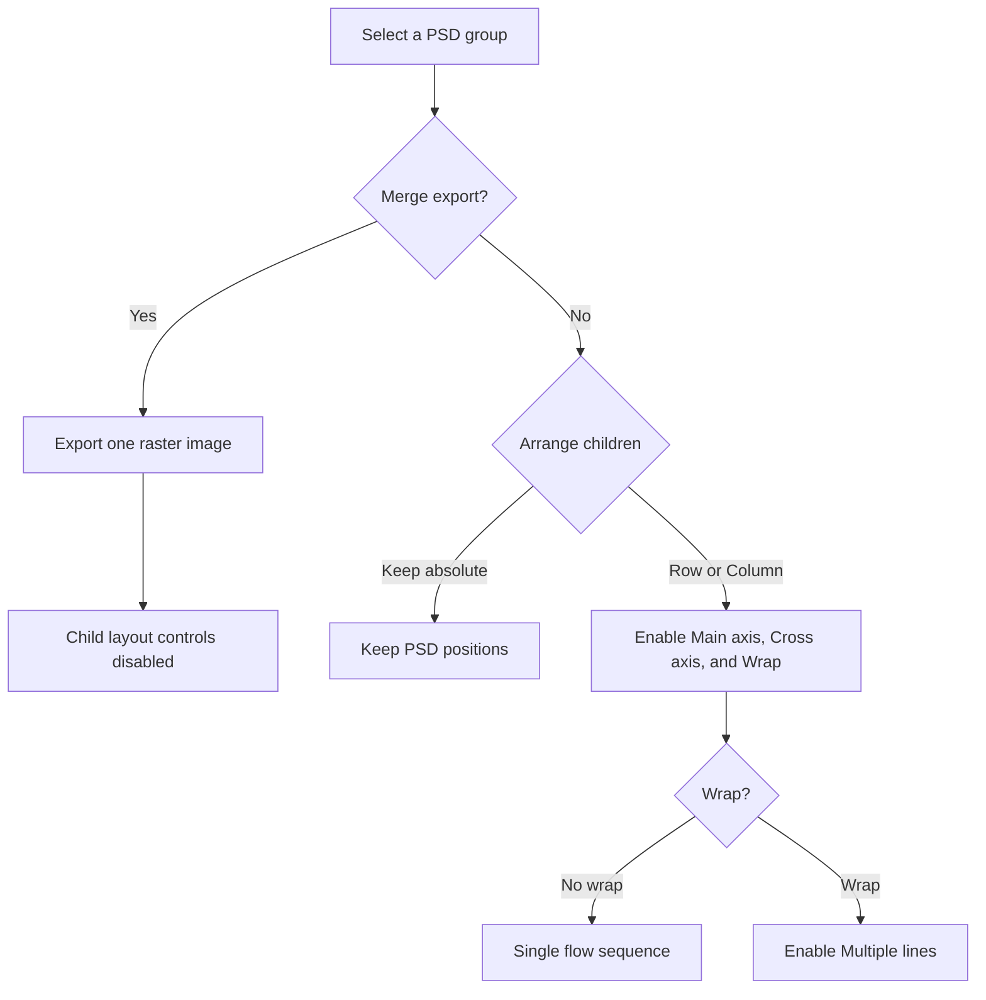
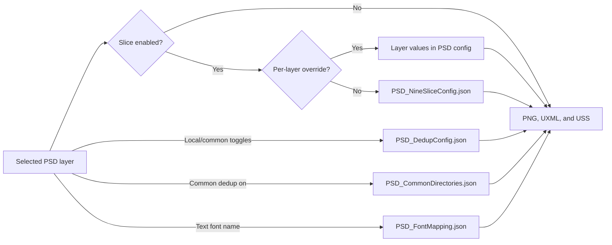

# PsdToUIToolKit

PsdToUIToolKit is a Unity Editor tool that reads Photoshop PSD and PSB layer structures and exports them as Unity UI Toolkit assets:

- PNG sprites for raster layers
- One UXML document for the UI hierarchy
- One USS stylesheet referenced by the UXML document

The project currently targets Unity `2022.3.62f3`. Export runs in the Unity Editor only; no runtime PSD conversion code is included.

## Quick start

1. Open the project in Unity `2022.3.62f3` and wait for scripts to compile.
2. Choose **Tools > PSD > UI Toolkit Editor**.
3. Click **Open PSD** and select a `.psd` or `.psb` file.
4. Select layers in the tree or canvas. Use the Inspector to choose which layers are exported, how raster images are handled, and how children are arranged.
5. Check the export settings:
   - **Image Root** defaults to `Assets/PsdToUIToolKit/Generated/Images`.
   - **UXML Root** defaults to `Assets/PsdToUIToolKit/Generated/Uxml`.
   - **Auto image naming** is enabled by default.
6. If needed, configure nine-slice detection, image deduplication, common image directories, or font mapping from **Tools > PSD > UI Toolkit**.
7. Click **Export**.
8. If the target UXML or USS already exists, review the replacement warning and choose **Replace All** only when those files can be overwritten.
9. Unity selects and opens the exported UXML. Open it in UI Builder to inspect the result and make final spacing or styling adjustments.

For a PSD named `login.psd`, the default outputs are:

```text
Assets/PsdToUIToolKit/Generated/Images/login/*.png
Assets/PsdToUIToolKit/Generated/Uxml/login.uxml
Assets/PsdToUIToolKit/Generated/Uxml/login.uss
```

The UXML references the USS file. Re-exporting replaces both UI Builder files after confirmation. It also removes top-level PNG files in the matching image folder that are no longer used by the current export. Do not keep manually maintained PNG files in that folder.

## Editor overview

The main window has three working areas:

- **Layer Tree**: displays the PSD hierarchy and supports single or multi-selection.
- **Canvas Preview**: switches between Layout, PSD, and Split views. The layout preview can be used to select and arrange nodes.
- **Inspector**: edits the selected layer or virtual layout group and contains the export settings.

The toolbar provides **Open PSD**, **Reload**, **Undo**, **Redo**, and **Export**. Reload asks for confirmation, then reparses the current PSD and permanently resets its PSD-specific configuration to the original defaults. Undo and Redo apply to layout edits in the current window session.

## Layer export parameters

The following fields are stored per PSD layer.

| Inspector field | Default | Applies to | Effect and related configuration |
| --- | --- | --- | --- |
| **Name** | PSD layer name | All layers | Becomes the UXML element name. Raster image names are derived from it after invalid filename characters and spaces are replaced. |
| **Export** | On | All layers | Off excludes the layer and its export contribution. An excluded non-clipped layer also breaks the current clipping sequence. |
| **Visible** | PSD visibility | All layers | Off keeps the element in UXML but writes `display: none`. It also updates the editor preview. |
| **Merge export** | Off | PSD groups | Exports the group as one composited raster image and stops exporting its children as separate layout nodes. Child layout fields are disabled while this is on. |
| **Slice / nine-slice** | On | Non-text raster output | Attempts to detect a stretchable center, builds a compact sliced PNG, sets the imported Sprite border, and writes `-unity-slice-*` styles. Detection may legitimately return no slice. |
| **Participate local dedup** | On | Non-text raster output | Allows identical raster content in the current PSD export to share one generated image. Comparison uses the global MAE threshold and fingerprint size. |
| **Participate common dedup** | On | Non-text raster output | Searches configured common directories for a matching PNG. A match is referenced instead of writing another PNG. |
| **Override nine-slice params** | Off | Non-text layers with nine-slice on | Uses this layer's five nine-slice values instead of the global `PSD_NineSliceConfig.json` values. |

Text layers are written as `ui:Label` elements. Other exported nodes are written as `ui:VisualElement` elements; raster nodes receive a `background-image`. Text export includes the parsed text, effective font size, fill color, supported outline and shadow effects, and an optional mapped font.

### Per-layer nine-slice overrides

These fields appear only when **Slice / nine-slice** and **Override nine-slice params** are both enabled.

| Inspector field | Default | Sanitized range | Meaning |
| --- | ---: | ---: | --- |
| **Border inset** | `2` | `0` or greater | Keeps candidate cut lines away from visible color boundaries. |
| **Pixel threshold** | `10` | `0` to `255` | Maximum per-channel RGBA difference for adjacent rows or columns to remain cuttable. Lower values are stricter. |
| **Min center cols** | `10` | `1` or greater during export | Caps the width of the rebuilt center block. The underlying JSON name is `nineSliceMinCenterCols`. |
| **Min center rows** | `10` | `1` or greater during export | Caps the height of the rebuilt center block. The underlying JSON name is `nineSliceMinCenterRows`. |
| **Min same-zone** | `15` | `1` or greater during export | Minimum contiguous region that must be considered consistently cuttable. |

If locally deduplicated layers have identical raster content but conflicting enabled nine-slice parameters, export stops and reports the conflicting layers. Keep their slice settings identical, disable nine-slice for at least one cluster policy, or disable local dedup for the layers that require different output.

## Layout intent parameters

Layout is explicitly configured. There is no automatic layout-analysis mode. Absolute positioning is the default.

| Inspector field | Choices | Availability | Effect |
| --- | --- | --- | --- |
| **In parent** | Follow parent layout; Keep original position | Every selected layer | **Follow parent layout** participates in a Row or Column parent. **Keep original position** remains absolutely positioned relative to the container. |
| **Arrange children** | Keep absolute; Row; Column | Unmerged PSD groups | Selects absolute child placement or a UI Toolkit flex direction. Leaf layers have no editable children. |
| **Main axis** | Preserve PSD spacing; Start; Center; End; Space between; Space around | Group uses Row or Column | Controls distribution along the flow direction. Non-preserve choices map to `justify-content`. |
| **Cross axis** | Preserve PSD offset; Start; Center; End | Group uses Row or Column | Controls perpendicular alignment and maps to `align-items`. |
| **Wrap** | No wrap; Wrap | Group uses Row or Column | Enables `flex-wrap: wrap` and PSD-derived line grouping. |
| **Multiple lines** | Preserve PSD lines; Start; Center; End | Wrap is enabled | Controls wrapped-line distribution and maps to `align-content`. |

**Preserve PSD spacing**, **Preserve PSD offset**, and **Preserve PSD lines** use positions inferred from the original PSD instead of forcing a standard CSS-style distribution.

### Layout dependencies



### Virtual layout groups

Virtual groups arrange selected sibling nodes without requiring a matching Photoshop group:

1. Hold Ctrl on Windows or Cmd on macOS and select two or more sibling layers in the tree or canvas.
2. Choose **Create Row Group** or **Create Column Group** in the multi-selection Inspector.
3. Select the virtual group to edit its name, Row or Column layout, main axis, cross axis, wrap, and multi-line settings.
4. Use the member controls to remove nodes, add sibling nodes, nest groups, wrap a group in another Row or Column, move it into a compatible group, or dissolve it.

Virtual groups may contain layer references and other virtual-group references. They are stored in the PSD-specific config and do not modify the original PSD.

## Export settings

These settings are stored in Unity `EditorPrefs`, so they are local to the current editor user rather than committed in a project JSON file.

| Inspector field | Default | Effect |
| --- | --- | --- |
| **Image Root** | `Assets/PsdToUIToolKit/Generated/Images` | The exporter creates `<Image Root>/<PSD file name>/` and writes generated PNGs there. A value without the `Assets` prefix is normalized under `Assets/`. |
| **UXML Root** | `Assets/PsdToUIToolKit/Generated/Uxml` | Receives `<PSD file name>.uxml` and `<PSD file name>.uss`. A value without the `Assets` prefix is normalized under `Assets/`. |
| **Auto image naming** | On | Appends the PSD layer ID to the sanitized layer name, for example `button_178.png`. When off, repeated names receive numeric suffixes as needed. |

The export button performs these operations:

1. Saves and synchronizes the PSD-specific config.
2. Warns before replacing an existing UXML or USS file.
3. Exports raster layers and imports generated PNGs as Sprites.
4. Builds the manually configured layout tree.
5. Writes the UXML and USS.
6. Deletes only stale top-level PNGs from the current PSD image folder.
7. Refreshes the Asset Database and opens the exported UXML.

## Global image settings

Global settings are stored under:

```text
Assets/PsdToUIToolKit/EditorConfig
```

If a JSON file does not exist or cannot be read, the defaults compiled into the tool are used.

### Nine-slice settings

Open **Tools > PSD > UI Toolkit > Nine-slice settings...**. Changes are saved immediately to `PSD_NineSliceConfig.json` and apply on the next export.

| UI field | JSON field | Default | Accepted range |
| --- | --- | ---: | ---: |
| **Border inset** | `borderInset` | `2` | `0` or greater |
| **Adjacent pixel threshold** | `pixelThreshold` | `10` | `0` to `255` |
| **Minimum contiguous cut zone** | `minSameZone` | `15` | `1` to `4096` |
| **Maximum center columns** | `minCenterCols` | `10` | `1` to `4096` |
| **Maximum center rows** | `minCenterRows` | `10` | `1` to `4096` |

```json
{
  "borderInset": 2,
  "pixelThreshold": 10,
  "minCenterCols": 10,
  "minCenterRows": 10,
  "minSameZone": 15
}
```

The historical JSON names `minCenterCols` and `minCenterRows` are retained even though the current settings window describes them as maximum center dimensions.

### Deduplication settings

Open **Tools > PSD > UI Toolkit > Dedup settings...**. Changes are saved immediately to `PSD_DedupConfig.json` and apply on the next export.

| UI field | JSON field | Default | Accepted range | Effect |
| --- | --- | ---: | ---: | --- |
| **MAE threshold** | `maeThreshold` | `0.04` | `0.001` to `0.5` | Maximum mean absolute error between premultiplied RGBA fingerprints. Lower values require a closer match. |
| **Fingerprint size (N x N)** | `fingerprintSize` | `8` | `4` to `32` | Resamples trimmed image content into an N by N fingerprint. Larger values preserve more detail but require more comparison work. |

```json
{
  "maeThreshold": 0.04,
  "fingerprintSize": 8
}
```

Local and common deduplication use the same threshold and fingerprint size. Local dedup compares exported layers with each other. Common dedup compares the post-nine-slice image, if any, against the cached common-directory PNGs.

### Common image directories

Select a folder in Unity's Project window and choose **Assets > PsdToUIToolKit > Add to Common Dir**. The folder is appended to `PSD_CommonDirectories.json`. Reopen the PsdToUIToolKit window if it was already open.

```json
{
  "paths": [
    "Assets/PsdToUIToolKit/Generated/Images/common"
  ]
}
```

Each configured directory is scanned recursively for PNG files. Paths may be Unity `Assets` paths, project-relative paths, or absolute paths. However, a matched PNG is usable only when it can be converted to a Unity asset path under the current project's `Assets` directory. Keep reusable common assets inside `Assets`.

There is no removal window for common directories. Remove obsolete entries by editing `PSD_CommonDirectories.json`.

### Font mapping

Open **Tools > PSD > UI Toolkit > Font mapping...** to map each Photoshop font name to a Unity `Font` or TextCore `FontAsset`.

```json
{
  "entries": [
    {
      "psdFontName": "ExamplePSFontName",
      "fontAssetPath": "Assets/Fonts/ExampleFont.asset"
    }
  ]
}
```

At export time, previously unseen PSD font names are automatically added to `PSD_FontMapping.json` with a blank asset path. Blank or invalid mappings use the UI Toolkit default font and produce a warning. Valid mappings are written as `-unity-font-definition` references.

## Configuration precedence and storage



### PSD-specific export config

Opening a PSD creates or updates:

```text
Assets/PsdToUIToolKit/PSDConfig/<PSD file name>_uitoolkit_export_config.json
```

The current schema is config version `4`. It stores:

- Per-layer export, visibility, merge, nine-slice, dedup, and layout settings keyed by PSD layer ID
- Virtual layout group names, host PSD parent IDs, member references, nesting, and layout settings

When the PSD is reopened, the tool synchronizes the current layer list while preserving settings for layer IDs that still exist. Config versions 1 through 3 are migrated in memory and saved as version 4.

The config filename uses only the PSD basename. Two PSD files in different folders with the same basename share one config file. Use unique PSD filenames to avoid unintended configuration overlap.

### Storage summary

| Setting category | Storage | Shared through version control? |
| --- | --- | --- |
| Layer and virtual-group settings | `PSDConfig/<PSD name>_uitoolkit_export_config.json` | Yes, when the file is committed |
| Nine-slice defaults | `EditorConfig/PSD_NineSliceConfig.json` | Yes, when the file is committed |
| Deduplication defaults | `EditorConfig/PSD_DedupConfig.json` | Yes, when the file is committed |
| Common image directories | `EditorConfig/PSD_CommonDirectories.json` | Yes, when the file is committed |
| Font mappings | `EditorConfig/PSD_FontMapping.json` | Yes, when the file is committed |
| Export roots and auto naming | Unity `EditorPrefs` | No; local to the editor user |

## Output details

- The UXML root is a relative-positioned `ui:VisualElement` named after the PSD, with the original canvas width and height and `overflow: hidden`.
- Text layers become `ui:Label`; raster and container nodes become `ui:VisualElement`.
- Absolute nodes retain PSD-derived left, top, width, and height.
- Row and Column containers use UI Toolkit flex styles plus PSD-derived padding, gaps, and margins.
- Nine-slice output sets both the imported Sprite border and the corresponding UXML slice styles.
- Common-directory matches are referenced directly and are not copied into the generated image folder.

Generated UXML and USS are drafts owned by the exporter. Make durable manual changes in a separate copy or be prepared to reapply them after export.

## Troubleshooting

### Layout controls are disabled

- **Arrange children** requires a PSD group.
- A merged group is a single raster node; turn off **Merge export** to arrange its children.
- Main axis, cross axis, and wrap require Row or Column.
- Multiple lines requires Wrap.

### Export reports conflicting nine-slice parameters

Identical layers participating in local dedup must resolve to a compatible export policy. Give them the same enabled nine-slice parameters or turn off local dedup for layers that need different slicing.

### Exported text uses the wrong font

Open **Font mapping...**, find the exact Photoshop font name, and assign a Unity `Font` or TextCore `FontAsset`. A blank or invalid asset path intentionally falls back to the UI Toolkit default font.

### A manually added PNG disappeared

After export, top-level PNGs in `Images/<PSD name>/` that are not referenced by the new result are treated as stale and deleted. Keep hand-authored images elsewhere, such as a configured common directory.

### Two PSD files appear to share settings

PSD config filenames use only the source basename. Rename one PSD so both files have unique basenames, then reopen it to create a separate config.

### Common-directory dedup does not find a match

Check that the layer has **Participate common dedup** enabled, the directory is listed in `PSD_CommonDirectories.json`, the candidate is a PNG under the current project's `Assets` directory, and the fingerprint difference is within the configured MAE threshold.

### The exported UXML or USS lost manual edits

Both files are replaced on re-export after a confirmation dialog. Keep long-lived customization in a separate copy or source-controlled patch workflow.
